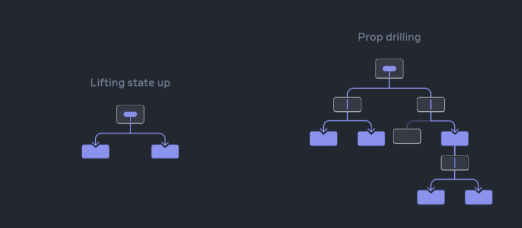

# Seção 1: Introdução ao React

## 1.1 O que é React?
Oficialmente, `React` é uma **biblioteca** front-end Javascript código aberto com foco em criar interfaces de usuário em páginas web.

Há algumas discurssões acerca deste tópico se o `react` é uma biblioteca ou um framework, porém na documentação oficial eles se denominam como biblioteca, e não são um framework porque ela é responsável apenas por renderizar os componentes da camada de visualização de uma aplicação

### 1.1.1 Origem
No início de 2011, os programadores do **Facebook** enfrentavam desafios significativos na manutenção do código à medida que a plataforma crescia com mais funcionalidades. O aumento na complexidade da aplicação exigia uma abordagem mais escalável e eficiente. Nesse contexto, o Facebook lançou o **XHP**, uma versão do PHP em 2010, com foco principal em mitigar ataques de **Cross Site Scripting (XSS)**, uma vulnerabilidade comum em sistemas nos quais os usuários tentam inserir código malicioso nas páginas web.

No entanto, o XHP não conseguia lidar com uma demanda crítica: aplicações web dinâmicas requerem muitas requisições, e o XHP não era eficaz nessa área. Diante desse desafio, **Jordan Walke**, um engenheiro do Facebook, propôs uma solução ousada. Ele negociou com seu gestor para levar o XHP para o navegador usando **JavaScript**, concordando em realizar um experimento de seis meses. O resultado desse experimento foi a criação do `React`.

Lançado pelo **Facebook** (agora **Meta**) em 2011, o `React` foi disponibilizado como uma tecnologia de código aberto em 2013. Sua origem estava diretamente relacionada à necessidade de otimizar a atualização e a sincronização de atividades simultâneas no feed de notícias da rede social, abrangendo elementos como chat, status, listagem de contatos, entre outros.

A primeira implementação prática do `React` ocorreu na timeline do Facebook ainda em 2011. Já em 2012, a tecnologia foi estendida para o Instagram, consolidando-se como uma ferramenta valiosa para o desenvolvimento de interfaces reativas e dinâmicas em ambientes de rápido crescimento como os das redes sociais.


### 1.1.2 Características
O `React` apresenta **características** distintas que o tornam ideal para casos específicos de desenvolvimento de aplicações web, proporcionando eficiência e escalabilidade.

**Atualização em Tempo Real**:
Um dos principais casos de uso do `React` é a criação de aplicações web que demandam atualizações em tempo real. Sua capacidade de atualizar a interface de usuário de maneira rápida e eficiente torna-o uma escolha natural para ambientes dinâmicos e interativos.

**Escalabilidade e Manutenção**:
O `React` é especialmente indicado para aplicações que precisam ser escaláveis e mantidas por equipes grandes. Sua natureza modular permite que **componentes** sejam reutilizados facilmente em diferentes partes da aplicação. Isso simplifica a manutenção e expansão de uma aplicação à medida que cresce, permitindo que equipes de desenvolvimento colaborem de maneira eficiente.

**Reusabilidade de Componentes**:
A biblioteca `React` é modular, facilitando a criação de **componentes** reutilizáveis. Essa abordagem promove a coesão do código e simplifica a gestão de funcionalidades específicas, melhorando a legibilidade e a manutenção do código.

**Integração com React Native**:
Além de seu papel no desenvolvimento web, o `React` é comumente utilizado em conjunto com o `React Native` para criar aplicações móveis nativas para **iOS e Android**. Essa sinergia permite que as equipes de desenvolvimento utilizem as mesmas habilidades e lógica de código para construir aplicações tanto para web quanto para dispositivos móveis.

**Alta Qualidade em Aplicações Móveis**:
A integração com o `React Native` possibilita a criação de aplicações móveis de alta qualidade. Essas aplicações oferecem uma experiência nativa para os usuários, embora sejam construídas utilizando tecnologias web, como JavaScript e CSS.

Essas características fazem do `React` uma escolha versátil, adaptável a diferentes contextos de desenvolvimento, desde aplicações web complexas até projetos móveis nativos. Sua modularidade, eficiência e integração com o `React Native` destacam-no como uma ferramenta poderosa para equipes de desenvolvimento em busca de soluções eficazes e de alta qualidade.

### 1.1.3 Reatividade
A **reatividade** no `React` é um princípio fundamental que possibilita aos **componentes** reagirem a alterações em seu estado ou nas propriedades que recebem. Essa capacidade é essencial para criar interfaces dinâmicas que se atualizam automaticamente conforme os dados ou o estado da aplicação se modificam. No `React`, a **reatividade** é predominantemente alcançada por meio do uso de **estados (state) e props**.

No exemplo abaixo, o componente `ExemploReact` ilustra o uso do hook `useState` para gerenciar o estado do componente, permitindo a **reatividade** à interação do usuário:

```javascript
import React, { useState } from "react";

const ExemploReact = () => {
   const [mensagem, setMensagem] = useState("Olá, React!");

   const atualizarMensagem = () => {
      setMensagem("Mensagem Atualizada!");
   };

   return (
           <div>
              <p>{mensagem}</p>
              <button onClick={atualizarMensagem}>Atualizar Mensagem</button>
           </div>
   );
}

export default ExemploReact;
```
Neste exemplo, ao clicar no botão, a função `atualizarMensagem` é acionada, chamando `setMensagem` para atualizar o estado. O `React` reage automaticamente, re-renderizando o componente com a nova mensagem. É importante notar que o `React` utiliza estados imutáveis para garantir a consistência e a previsibilidade no gerenciamento de estados.


### 1.1.4 Relação com o MVC (Model-View-Controller)
A arquitetura **MVC** (Model-View-Controller) é um padrão comumente usado no desenvolvimento de software para separar as preocupações relacionadas aos dados, à apresentação e à lógica de controle. Embora o `React` em si não siga explicitamente a arquitetura **MVC** tradicional, ele pode ser integrado em projetos que seguem esse padrão de design.

- **Componentes (View e Controller)**: No `React`, a UI é representada por **componentes**. Esses componentes podem ser comparados à **"View"** no padrão MVC, pois são responsáveis pela renderização da interface do usuário. Além disso, os componentes no `React` também podem incorporar lógica de controle, que pode ser comparada ao papel do **"Controller"** na arquitetura MVC.


- **Estado (Model)**: O **estado** em `React` representa os dados da aplicação que podem ser alterados ao longo do tempo. Embora o estado no `React` não seja uma representação direta do **"Model"** no MVC, ele desempenha um papel semelhante ao armazenar e gerenciar os dados da aplicação.


- **Fluxo de Dados Unidirecional**: O `React` promove um **fluxo de dados unidirecional**, o que significa que a comunicação ocorre em uma direção específica. Essa abordagem é semelhante à ideia de controle de fluxo no padrão **MVC**, onde as alterações no modelo (ou estado, no caso do React) acionam a atualização da visualização (ou componente).

### 1.1.5 Adoção Incremental no React

A **adoção incremental**, um processo gradual de incorporação de novas tecnologias ou métodos, é uma estratégia que o `React` facilita, permitindo sua introdução suave em projetos existentes. Essa capacidade é uma das **características** marcantes e vantajosas do `React`, que proporciona uma transição gradual, sem a necessidade de reescrever completamente o código existente.

Ao considerar a integração do `React` em um contexto já estabelecido, é fundamental reconhecer os desafios potenciais que podem surgir. **A dependência de bibliotecas** ou frameworks existentes pode gerar dificuldades, especialmente quando os paradigmas de programação são distintos. A integração do `React` em um ambiente previamente baseado em jQuery, por exemplo, requer atenção meticulosa para garantir uma transição harmoniosa.

A adoção incremental pode resultar em uma **arquitetura híbrida**, onde diferentes partes do projeto seguem padrões diversos. Essa diversidade arquitetônica pode gerar desafios de compreensão e manutenção do código, especialmente se a equipe não estiver totalmente familiarizada com a abordagem adotada.

Para preservar a coerência arquitetural durante esse processo, é crucial estabelecer diretrizes claras sobre como os novos componentes `React` devem integrar-se ao restante do código. Garantir que toda a equipe compreenda essas diretrizes é essencial para evitar inconsistências e manter a estabilidade do projeto.


## 1.2 Por que React?
O `React` é a preferência de muitas empresas de tecnologia, incluindo **Instagram, Netflix, Airbnb e Twitter**, para o desenvolvimento de aplicações web e móveis. Essa ampla adoção destaca a eficácia e confiabilidade da tecnologia em cenários do mundo real.

A popularidade do `React` não se limita apenas ao seu uso por grandes empresas, sua **comunidade ativa** e vibrante também desempenha um papel crucial. Como uma biblioteca de código aberto, o `React` atrai uma considerável base de desenvolvedores e desenvolvedoras que contribuem com códigos e recursos. Essa comunidade ativa não apenas valida a robustez da tecnologia, mas também assegura **atualizações regulares, correções de bugs e a introdução de novos recursos**, consolidando ainda mais a posição do `React` como uma escolha **popular e confiável** no desenvolvimento de interfaces de usuário modernas.

### 1.2.1 Casos de Uso
Abaixo estão alguns casos de uso comuns do React:

- **Single Page Application (SPA)**: `React` é amplamente reconhecido como uma escolha robusta para o desenvolvimento de **SPAs**, oferecendo uma experiência de usuário contínua, onde a navegação entre diferentes seções do aplicativo ocorre sem a necessidade de recarregar a página. A capacidade de atualizar apenas partes específicas da interface do usuário, graças à reconciliação do **virtual DOM**, melhora significativamente o desempenho em comparação com abordagens tradicionais.


- **Aplicações Móveis (React Native)**: `React Native`, uma extensão do `React`, é uma opção popular para o desenvolvimento de aplicativos móveis nativos para **iOS e Android**. Ele permite que os desenvolvedores usem componentes `React` para criar interfaces de usuário nativas, compartilhando uma porção significativa do código entre as plataformas. Isso economiza tempo e recursos, proporcionando uma experiência consistente em dispositivos móveis.

### 1.2.2 React vs Outros Frameworks

Abaixo, será encontrado um resumo da comparação entre a biblioteca `React` e os frameworks **Angular e Vue**. Cada uma dessas ferramentas desempenha um papel fundamental no desenvolvimento de aplicações web, apresentando diferentes abordagens em termos de tamanho, flexibilidade e velocidade.

#### 1.2.2.1 Angular
- **Tamanho**: Angular tende a ter um tamanho inicial maior em comparação com `React` e Vue.js. Isso se deve à inclusão de muitos recursos diretamente no núcleo da estrutura.


- **Velocidade**: Angular segue uma abordagem mais opiniativa, o que pode limitar a flexibilidade em comparação com `React` e Vue.js. Embora ofereça um conjunto abrangente de recursos, essa estrutura pode ser mais adequada para projetos grandes e complexos, onde uma estrutura mais rígida é benéfica.


- **Flexibilidade**: Angular oferece uma vinculação de dados bidirecional poderosa, mas pode apresentar desafios de desempenho em comparação com `React` e Vue.js.


#### 1.2.2.1 Vue.js
- **Tamanho**: Vue possui um tamanho inicial menor em comparação com `React`. Sua arquitetura modular permite incluir apenas os recursos necessários, resultando em pacotes mais leves e um carregamento mais rápido da aplicação.


- **Velocidade**: Vue é altamente flexível, seguindo uma abordagem progressiva. Os desenvolvedores podem adotar gradualmente as funcionalidades conforme necessário, o que facilita a integração em projetos existentes e proporciona uma curva de aprendizado suave.


- **Flexibilidade**: Vue oferece um desempenho sólido, aproveitando uma abordagem reativa para a atualização da interface do usuário. Sua eficiência na manipulação do DOM contribui para uma experiência ágil para os usuários.

## 1.3 Primeiros passos com o React

### Como criar um projeto React?

Primeiramente, é necessário ter o Node.js e o npm instalado no computador.
Após isso, é preciso instalar o create-react-app, que é a CLI que
automatiza a criação e configuração inicial de projetos React.js.

O create-react-app é instalado com o comando:

```bash
npm install -g create-react-app
```

Para criar um novo projeto, basta executar o comando:

```bash
npm create-react-app <<nome do projeto>>
```

**Obs:** usando **npx** em vez do npm, não há a necessidade de instalar o
create-react-app

Será criada uma pasta com o nome do projeto, que já é um repositório
monitorado pelo git, e dentro dela estarão pastas
e arquivos padrão. Os principais estão listados abaixo.

- **Readme.md** é o arquivo markdown onde é possível adicionar informações
  sobre o projeto
- **node_modules** inclui todas as dependências do projeto
- **package.json** é o arquivo que gerencia as dependências do projeto e os
  scripts necessários para a execução da aplicação
- **.gitignore** arquivo usado para excluir pastas e outros arquivos do rastreamento
  do Git
- **public** é a pasta utilizada para armazenas itens estáticos do projeto, como
  como imagens e svgs
- **src** é a pasta que conterá todo o código-fonte da aplicação. Todo os componentes,
  arquivos CSS e outros códigos ficarão neste diretório

Após a criação da aplicação, para iniciá-la, basta navegar até a pasta criada e
executar o comando:

```bash
npm start
```

Há uma forma alternativa mais rápida para criar projetos React que é utilizando o Vite, que
é uma ferramenta de construção de projetos web conhecida por sua rapidez.

Para criar um novo projeto React com o Vite, primeiro, é preciso executar o comando:

```bash
npm create vite@latest
```

Após isso, pelo CMD, é preciso informar o nome da aplicação, o framework/biblioteca e a linguagem
que será utilizada.

Por fim, é necessário navegar até a pasta que foi criada, instalar as dependências e, então,
iniciar a aplicação. Os últimos dois passos são feitos com os comandos:

```bash
npm install
npm run dev
```

## 1.4 Primeiro componente React

O componente deve retorno seu conteúdo envolto em uma única tag HTML

```javascript
import React from 'react';

function PrimeiroComponente(){
  return(
    <div>
      <h1>Título do Componente</h1>
      <p>Texto dentro do componente</p>
    </div>
  );
}

export default PrimeiroComponente;
```

### Integrando componentes

```javascript
import React from 'react';
import PrimeiroComponente from './PrimeiroComponente.jsx';

function SegundoComponente(){
  return(
    <div>
      <h1>Título do componente pai</h1>
      <h1>Início do componente filho</h1>
      <PrimeiroComponente/>
      <h1>Fim do componente filho</h1>
    </div>
  );
}

export default SegundoComponente;
```

### O componente App

```javascript
import React from 'react';
import SegundoComponente from './SegundoComponente.jsx';

function App(){
  return(
    <SegundoComponente/>
  );
}

export default App;
```

# 2: Arquitetura do React

## 2.1 Estrutura de Componentes do React

### O que são componentes?

Componentes são blocos independentes e reutilizáveis de código que encapsulam sua própria lógica, estado e
elementos a serem renderizados para compor a interface gráfica do usuário.

Com esse conceito, intrerfaces complexas podem facilmente construídas a partir de uma árvore
de componentes, que podem ter sua própria configuração interna e passar dados para outros
componentes.

Os componentes em React são divididos em dois tipos principais: componentes de classe e componentes
funcionais. Componentes de classe são classes JavaScript com um método **render** que retorna o JSX a ser
renderizado. Já os componentes funcionais são funções JavaScript que retornam o JSX. Com a introdução dos hooks
nos componentes funcionais, o controle do ciclo de vida dos componentes ficou simplificado e
o código se tornou menos verboso. Devido a isso, os componentes de classe estão em desuso.

#### Componente de classe

```javascript
import React from 'react';

class Componente extends React.Component{
  render(){
    return(
      <div>
        <h1>Olá Mundo!</h1>
      </div>
    );
  }
}
```

#### Componente funcional

```javascript
function Componente(){
  return(
    <div>
      <h1>Olá Mundo!</h1>
    </div>
  );
}
```

### Props e State

Ao encarar os componentes como funções, podemos considerar que as props são os argumentos recebidos pela função
que define o componente. As props, são a forma de os componentes receberem dados de forma
dinâmica.

Por sua vez, os states são a forma que os componentes têm de armazenar um estado interno. Podemos fazer uma analogia
com os atributos de um objeto, o que permite que o componente reaja de formas diferentes a depender da configuração
do seu estado.

#### Props

```javascript
function Child(props){
  return (
    <p>O valor é: {props.valor}</p>
  );
}

function Parent(){
  return(
    <>
      <Child valor={10}/>
    </>
  );
}
```

#### State

```javascript
import {useState} from 'react'

function Exemplo(){
  const [cor, setCor] = useState("Amarelo");
  
  const mudarCor = () => {
    if(cor === "Amarelo"){
      setCor("Azul");
    } else {
      setCor("Amarelo");
    } 
  }
  
  return (
    <>
      <span>A cor atual é: {cor}</span>
      <button onClick={mudarCor}>Trocar cor</button>
    </>
  );
}
```

### Principais benefícios do uso de componentes

- **Reutilização de código:** Uma vez definidos, os compoenentes são reutilizáveis e podem ser
  utilizados em diferentes partes da aplicação, o que promove economia de tempo e mantém o código
  mais limpo e coeso
- **Separação de responsabilidades:** Cada componente pode ser construído para lidar
  com uma única parte da interface do usuário, permitindo uma clara separação das responsabilidades
  dentro do código
- **Encapsulamento:** Os componentes encapsulam seu estado e a lógica que define o seu comportamento.
  Desse modo, alterações no comportamento de um componente não alteram diretamente o comportamento de outro,
  facilitando a manutenção do código
- **Eficiência:** Alterações no estado de um componente não necessariamente impactam outros componentes. Com
  o modelo de virtual DOM do React, a mudança de estado em um componente não exige a renderização de
  todos os outros componentes da tela

## 2.2 Ciclo de vida dos componentes em React

Cada componente do React possui um ciclo de vida composto por 3 fases:
montagem, atualização e desmontagem. Em cada uma dessas fases há métodos
que permitem ao programador manipular o ciclo de vida do componente.

## Abordagem para componentes de classe

### Fase de Montagem (Mounting)

Nesta fase, o componente é construído e inserido na DOM

O método **constructor** é o primeiro dessa fase. É nele que devemos configurar
o estado inicial do componente e definir qualquer outro valor inicial que seja
relevante.

````javascript
class Exemplo extends React.Component{
    constructor(props){
        super(props);
        this.state = {nomeCliente = "Gabriel"};
    }
}
````

O método **getDerivedStateFromProps** é invocado antes da renderização do
componente na tela e atualiza o estado do componente com base no valor das props.

```javascript
class Exemplo extends React.Component{
    constructor(props){
        super(props);
        this.state = {nomeCliente = "Gabriel"};
    }
    
    static getDerivedStateFromProps(newProps, currentState){
        return {nomeCliente = "José"};
    }
}
```

O método **render** retorna o JSX do componente para que ele seja renderizado
na tela.

```javascript
class Exemplo extends React.Component{
    render(){
        return (
            <h1>Hello World!</h1>
        );
    };
}
```

O método **componentDidMount** é o último da fase de montagem e é invocado após
o componente ser renderizado. É o lugar ideal para inserir códigos que necessitam
do componente já em tela, como temporizadores, por exemplo.

```javascript
class Exemplo extends React.Component{
    constructor(props){
        super(props);
        this.state = {titulo = "Primeiro Título"};
    }
    
    render(){
        return (
            <h1>Titulo: {this.state.titulo}</h1>
        );
    };
    
    componentDidMount(){
        setTimeout(() => {
            this.state({titulo: "Segundo Titulo"})
        }, 5000);
    }
}
```

### Fase de Atualizaçao (Updating)

Esta fase é executada sempre que ocorrer uma mudança nas props ou no
estado do componente

O primeiro método é o **getDerivedStateFromProps**, que funciona da mesma
forma que na fase de montagem e atualiza o estado do componente com base
nas props

O método **shouldComponentUpdate** retorna um valor booleano que indica se
o componente deve atualizar ou não. Como parâmetros, ele recebe os novos valores
das props e do estado

```javascript
class Exemplo extends React.Component{
    // ...

    shouldComponentUpdate(newProps, newState){
        if(newProps.numero > 5){
            return true;
        } else{
            return false;
        }
    }

    render(){
        return (
            <h1>Numero: {this.state.numero}</h1>
        );
    };
}
```

O método **getSnapshotBeforeUpdate** é invocado antes de o componente ser
novamente renderizado e recebe como parâmetros os valores antigos das props
e do estado. Ele é utilizado também para capturar outros valores relevantes
e seu valor de retorno será usado mais adiante.

O método **render** também funciona da mesma forma que na fase de montagem.

O método **componentDidUpdate** é executado logo após a renderização e encerra
a fase de atualização. Ele recebe como parâmetros os antigos valores das props,
do estado, e também o valor retornado pelo método **getSnapshotBeforeUpdate**

```javascript
class Exemplo extends React.Component{
    // ...

    getSnapshotBeforeUpdate(prevProps, prevState){
        return window.scrollY;
    }

    render(){
        return (
            <h1>Hello World!</h1>
        );
    };
    
    componentDidUpdate(prevProps, prevState, snapshot){
        window.scrollTo(0, snapshot);
    }
}
```

### Fase de Desmontagem (Unmounting)

O método **componentWillUnmount** é o único a ser executado nessa fase
e é invocado imeditamente antes de o componente ser removido da DOM.

```javascript
class Exemplo extends React.Component{
    constructor(props) {
        super(props);
        this.state = {show: true};
    }
    
    
    deletar = () => {
        this.setState({show: false});
    }
    
    render() {
        return (
            <div>
                {this.state.show && <Filha />}
                <button type="button" onClick={this.deletar}>Deletar</button>
            </div>
        );
    }
}

class Filha extends React.Component{
    componentWillUnmount(){
        alert("O componente será removido!");
    }
    
    render(){
        return (
            <h1>Hello World!</h1>
        );
    }
}
```

## Abordagem para componentes funcionais

### Fase de Montagem (Mounting)

O hook **useState** permite configurar o estado inicial do componente, inclusive
considerando o valor das props. Ele substitui os métodos **constructor** e
**getDerivedStateFromProps**.

O retorno do componente funcional é o JSX que será renderizado na DOM, sendo assim,
não é necessário declarar explicitamente o método **render**.

```javascript
import { useState } from "react";

function Exemplo(props) {
    const [nome, setNome] = useState("Gabriel");
    const [idade, setIdade] = useState(props.idade);

    return (
        <div>
            <h2>Nome: {nome} - Idade: {idade}</h2>
        </div>
    );
}
```

O hook **useEffect** com um array de dependências vazio executa sua função
apenas uma vez, assim que o componente é montado. Desse modo, ele substitui
o método ComponentDidMount.

```javascript
import { useEffect } from "react";

function Exemplo() {
    useEffect(() => {
        console.log("O componente foi montado")
    }, []);

    return (
        <div>
            <h2>HelloWorld!</h2>
        </div>
    );
}
```

### Fase de Atualização (Updating)

O método **getDerivedStateFromProps** pode ser substituído pelo hook
**useState** atribuindo ao estado o valor da prop e o hook **useEffect**
para monitorar as mudanças no valor da prop.

O hook **useEffect** sem um array de dependências executa sua função
todas as vezes que o componente for renderizado. Substitui o método
**componentDidUpdate**.

```javascript
import { useEffect, useState } from "react";

function Exemplo(props) {
    const [valor, setValor] = useState(props.valor);

    useEffect(() => {
        setValor(props.valor);
    }, [props.valor]);

    useEffect(() => {
        console.log("O componente foi atualizado");
    });

    return (
        <div>
            <h2>O valor é {valor}</h2>
        </div>
    );
}
```

Os outros métodos dessa fase também podem ser simulador utilizando hooks, principalmente os
já apresentados **useState** e **useEffect**. No exemplo abaixo, o método getSnapshotBeforeUpdate
é simulado com o hook **useEffect**.

```javascript
function Componente(props) {
  const [prevProps, setPrevProps] = useState(props);

  useEffect(() => {
    
    if (prevProps.valor !== props.valor) {

      // O antigo valor das props está disponível

      setPrevProps(props);
    }
  }, [props, prevProps]);
  
  // ...
```

### Fase de Desmontagem (Unmounting)

Com o hook **useEffect**, é possível substituir o método **componentWillUnmount**.
É preciso que o array de dependências esteja vazio e que a função passada ao
hook retorne uma função, que será executada sempre que o componente for desmontado.

```javascript
import { useEffect } from "react";

function Exemplo() {
    useEffect(() => {
        
        return () => {
            console.log("Componente será desmontado");
        }
        
    }, []);

    return (
        <div>
            <h2>HelloWorld!</h2>
        </div>
    );
}
```

## 2.3 Comunicação entre componentes

Uma vez que os componentes podem formar uma estrutura de árvore para construir
interfaces complexas, é fundamental que haja formas de comunicação entre os componentes pais
e filhos. O fluxo de dados em uma estrutura de componentes deve ser unidirecional, com o dado
sempre sendo passado do componente pai para o componente filho, e o componente pai nunca tendo
acesso ao estado do componente filho

### Principais estratégias de comunicação

- **Props:** As props são a forma mais simples de transferência de dados entre componentes. Com as
  props, os componentes pai podem passar dados para seus componentes filhos. Esse sentido é único, e
  os componentes que recebem as props não devem modificá-las

```javascript
function Child(props){
  return (
    <p>O valor é: {props.valor}</p>
  );
}

function Parent(){
  return(
    <>
      <Child valor={10}/>
    </>
  );
}
```

- **State Lift:** Como dito acima, o elemento pai não consegue ter acesso ao state do elemento filho,
  mas e se isso for necessário para a aplicação? A solução é usar o state lift. Nesta técnica, para que
  o componente pai tenha acesso a um state do elemento filho, basta que este state esteja no elemento pai
  e ele seja passado ao componente filho por meio das props, juntamente com sua função de set

```javascript
function Child(props){
  return (
    <div>
      <p>Contador: {props.contador}</p>
      <button onClick={props.incrementar}>Incrementar</button>
    </div>
  );
}

import {useState} from 'react';

function Parent(){
  const [contador, setContador] = useState(0);
  
  const incrementar = () => {
    setCounter((prevCounter) -> prevCounter + 1);
  }
  
  return (
    <>
      <Child contador={contador} incrementar={incrementar}/>
    </>
  );
}
```

- **Context API:** É um recurso que permite o compartilhamento de dados entre componentes da árvore
  sem que seja necessário passar as props manualmente por cada nível da hierarquia. Sendo assim, o
  Context API nos dá uma forma de possuir dados "globais" para uma árvore de componentes.

```javascript
// ----- Criação do contexto -----

import {createContext} from 'react'

const Contexto = createContext();

export default Contexto;

// ----- Componente mais alto da hierarquia -----

function Parent(){
  const [total, setTotal] = useState(0);

  return (
    <Contexto.Provider value={[total, setTotal]}>
      <Children />
    </Context.Provider>
  );
}

// ----- Componente filho -----

import {useContext} from 'react'

const Children(){
  const [total, setTotal] = useContext(Contexto);
  
  return (
    <p>O total é: {total}</p>
  );
}
```

# Seção 3 - Padrões de Projeto

## 3.1 Padrões de Projeto em React
Com sua arquitetura centrada em componentes e DOM virtual, o React oferece uma estrutura robusta para a criação de aplicações web dinâmicas e interativas. No entanto, à medida que a complexidade dos aplicativos aumenta, manter um código limpo, escalável e facilmente mantido torna-se um desafio significativo. É nesse cenário que entram em cena os padrões de design do React.

### 3.1.1 Introdução
Conforme os aplicativos React crescem em escala e complexidade, os desenvolvedores frequentemente se deparam com desafios relacionados à organização, escalabilidade e manutenção do código. Os padrões de design React surgem como um conjunto de soluções comprovadas para esses obstáculos comuns, proporcionando uma abordagem estruturada para a construção de aplicativos React.

Esses padrões oferecem uma resposta organizada e eficaz, tornando os aplicativos React mais compreensíveis, testáveis e de manutenção simplificada. Ao adotar esses princípios, os desenvolvedores podem enfrentar com confiança os desafios crescentes associados ao desenvolvimento de aplicativos React, garantindo uma base sólida para a evolução contínua e aprimoramento do código.

### 3.1.2 Composição > Herança
Para introduzir essa seção decidi colocar a citação de um **desenvolvedor do Facebook**:
"A principal característica do React é a **composição dos componentes**. Componentes escritos por pessoas diferentes devem funcionar bem juntos. É importante para nós que você possa adicionar funcionalidade a um componente sem causar alterações ondulantes em toda a base de código. Por exemplo, deve ser possível introduzir algum estado local em um componente sem alterar nenhum dos componentes que o utilizam. Da mesma forma, deve ser possível adicionar algum código de inicialização e desmontagem a qualquer componente quando necessário.

No React, os componentes descrevem qualquer comportamento componível, e isso inclui renderização, ciclo de vida e estado. Algumas bibliotecas externas, como Relay, aumentam os componentes com outras responsabilidades, como descrever dependências de dados."

#### 3.1.2.1 O que faz a Composição ser superior?
##### 3.1.2.1.1 Contenção 
Alguns componentes não tem como saber quem serão seus elementos filhos. Isso é muito comum para componentes como o SideBar ou Dialog que representam “caixas” genéricas.

Recomendasse que esses componentes utilizem a prop especial children para passar os elementos filhos diretos para sua respectiva saída:

```javascript
function FancyBorder(props) {
  return (
    <div className={'FancyBorder FancyBorder-' + props.color}>
      {props.children}
    </div>
  );
}

Isso permite outros componentes passarem elementos filhos no próprio JSX:

function WelcomeDialog() {
  return (
    <FancyBorder color="blue">
      <h1 className="Dialog-title">
        Bem-vindo
      </h1>
      <p className="Dialog-message">
        Obrigado por visitar a nossa espaçonave!
      </p>
    </FancyBorder>
  );
}
```

##### 3.1.2.1.2 Especialização
Algumas vezes acabamos pensando em componentes como “casos especiais” de outros componentes, por exemplo, podemos dizer que o componente WelcomeDialog é um caso especial de Dialog.

No React, isto também pode ser obtido através do uso de composição, um componente específico renderiza um componente mais “genérico” e o configura com as suas respectivas props:

```javascript
	function Dialog(props) {
        return (
            <FancyBorder color="blue">
            <h1 className="Dialog-title">
                {props.title}
            </h1>
            <p className="Dialog-message">
                {props.message}
            </p>
            </FancyBorder>
        );
    }

    function WelcomeDialog() {
        return (
            <Dialog
            title="Bem-vindo"
            message="Obrigado por visitar a nossa espaçonave!" />
        );
    }

```

##### 3.1.2.1.3 E sobre a Herança?
Mais uma vez os Desenvolvedores do Facebook afirmam:
“No Facebook, nós usamos o React em milhares de componentes, e **não encontramos nenhum caso** que recomendaríamos criar componentes utilizando hierarquia de herança.”

O uso de props e composição irá te dar toda flexibilidade que você precisa para customizar o comportamento e aparência dos componentes, de uma maneira explícita e segura. Lembre-se de que os componentes podem aceitar um número variável de props, incluindo valores primitivos, como int, array, boolean; assim como elementos React e funções.

E se você desejar reutilizar funcionalidades (não gráficas) entre componentes, ´é sugerido que você a extraia em módulos JavaScript. Os componentes podem importar essa função, objeto ou classe sem precisar estender.

## 3.2 Por que os Padrões de Design são Importantes no React
**Organização de código:** os padrões de design oferecem uma maneira estruturada de organizar seus componentes e lógica do React, tornando sua base de código mais gerenciável à medida que evolui.

**Reutilização:** Seguindo padrões de design, você pode criar componentes e funcionalidades reutilizáveis, reduzindo a duplicação e promovendo eficiência.

**Escalabilidade:** os padrões de design ajudam a garantir que seu aplicativo React possa ser dimensionado normalmente à medida que cresce em complexidade e tamanho.

**Capacidade de manutenção:** código bem estruturado é mais fácil de manter e depurar, economizando tempo e esforço no longo prazo.

## 3.3 Singleton e Context API
Context API no React é uma ferramenta poderosa para gerenciar o estado global de uma aplicação. Ela permite que dados sejam compartilhados entre componentes sem a necessidade de passar props profundamente através da árvore de componentes.

Esse contexto é criado usando o método:
 ```javascript
    createContext()
``` 
e pode ser acessado por qualquer componente dentro da árvore de componentes.

### 3.3.1 Exemplo Prático
Vamos criar um contexto para gerenciar o tema da aplicação.
O provedor definirá o tema atual (por exemplo, “claro” ou “escuro”).
Os componentes filhos poderão acessar esse tema e aplicá-lo em suas interfaces.

```javascript
TemaContext.js
import React, { createContext, useContext, useState } from 'react';

const TemaContext = createContext();

export function TemaProvider({ children }) {
  const [tema, setTema] = useState('claro');

  return (
    <TemaContext.Provider value={{ tema, setTema }}>
      {children}
    </TemaContext.Provider>
  );
}

export function useTema() {
  return useContext(TemaContext);
}

Componente que consome o contexto
import React from 'react';
import { useTema } from './TemaContext';

function BotaoTema() {
  const { tema, setTema } = useTema();

  return (
    <button onClick={() => setTema(tema === 'claro' ? 'escuro' : 'claro')}>
      Alternar Tema
    </button>
  );
}
```

## 3.4 Padrão Observer 
O padrão Observer permite que um componente notifique e atualize outros componentes sobre mudanças no estado ou nos dados sem que esses componentes precisem estar cientes uns dos outros. Em componentes funcionais, você pode implementar esse padrão usando Context API do React para gerenciamento global dos estados.

O React, embora não siga o padrão Observer de maneira idêntica a outras bibliotecas, aplica o conceito por meio do **state** e **props**. Vamos explorar como os componentes no React observam mudanças no estado e reagem a essas alterações para renderizar a interface do usuário.

### 3.4.1 Exemplo Prático
Neste exemplo, ThemeProvider é um componente observável que gerencia o estado do tema. ThemedButton é um componente observador que consome o contexto do tema. Quando o tema muda ThemeProvider, todos ThemedButton os componentes irão atualizar automaticamente seus estilos, demonstrando o poder do padrão Observer no React.


## 3.5 Padrão Factory
O padrão Factory é útil quando você precisa criar e retornar componentes dinamicamente com base em condições ou parâmetros específicos. Em componentes funcionais, você pode implementar esse padrão criando uma função de factory que gera e retorna instâncias dos componentes com base na entrada.

### 3.5.1 Exemplo Prático
Aqui ButtonFactory é uma função que gera componentes de  com estilos diferentes com base no parâmetro type. Essa abordagem permite criar facilmente vários tipos de botões invocando createButton com diferentes argumentos, tornando seu código mais dinâmico e adaptável.


## 3.6 Conclusão quanto ao uso de Design Patterns
Os padrões de design React são ferramentas poderosas para estruturar e otimizar seus aplicativos React. 

Ao compreender e implementar esses padrões, você pode:
- escrever códigos mais limpos, 
- implementar sistemas de fácil manutenção, 
- construir aplicativos robustos e escaláveis. 

Experimente esses padrões em seus projetos e adapte-os às suas necessidades específicas.

# Seção 4: Técnicas Avançadas de Implementação
Nesta seção  serão exploradas técnicas avançadas de implementação no React, visando aprofundar o conhecimento e a habilidade na criação de aplicações web robustas e eficientes.

## 4.1 Uso de Hooks
Os **Hooks** representam uma adição poderosa ao React, proporcionando uma abordagem mais intuitiva e eficiente para o gerenciamento de estado, efeitos colaterais e outros recursos em componentes funcionais.
Essa inovação elimina a necessidade de classes, simplificando consideravelmente a estrutura do código e conferindo maior legibilidade ao desenvolvimento.

O uso de Hooks no React oferece vários benefícios significativos:

- **Simplicidade de Código**: Reduz a necessidade de classes, simplificando a estrutura do código e tornando-o mais legível.

- **Componentes Funcionais Mais Poderosos**: Capacita os componentes funcionais a terem o mesmo poder e funcionalidades que os componentes de classe, eliminando a necessidade de usar classes para determinadas tarefas.

- **Facilidade de Manutenção**:Reduz a complexidade e o acoplamento, tornando os componentes mais fáceis de entender, manter e testar.

A utilização dos diversos hooks integrados na biblioteca React ou a criação de hooks personalizados proporcionam flexibilidade para atender às necessidades específicas de cada projeto.
Essa capacidade de combinar e personalizar hooks permite escalabilidade e aprimoramento de operações e gerenciamento mais complexos.

### 4.1.1 UseState
`useState` é um React Hook que permite adicionar uma variável de estado ao seu componente.

A função `useState`é uma função que retorna dois valores: a variável de estado atual e uma função para atualizar essa variável.

```javascript
const [state, setState] = useState(initialState);
```
- '**initialState**':' representa o valor que você deseja que o estado tenha inicialmente, pode ser um valor de qualquer tipo.
- **Retorno**: o `useState` retorna um array com exatamente dois valores: O estado atual e a função **set**, que possibilita a atualização do estado para um valor diferente, acionando uma nova renderização.

Exemplo de utilização em um componente:

```javascript
import { useState } from 'react';

const Form = () => {
    const [nome, setNome] = useState("")
    const [email, setEmail] = useState("")
    ...
    
    const handleSubmit = (e) => {
        e.preventDefault();
        const pessoa = {nome, email, ...}
        //lógica para salvar uma pessoa
    }
    
    return (
        <div className="forms">
            <form onSubmit={handleSubmit}>
                <label>
                    <span>Nome: </span>
                    <input type="text" name="nome" placeholder="Digite o seu nome" value={nome} onChange={(e) => setNome(e.target.value)} required />
                </label>
                <label>
                    <span>Email: </span>
                    <input type="email" name="email" placeholder="Digite o seu email" value={email} onChange={(e) => setEmail(e.target.value)} required />
                </label>
                ...
            </form>
        </div>
    )
}

export default Form;
```

### 4.1.2 UseEffect
`useEffect` é um React Hook  fundamental que possibilita a execução de efeitos colaterais em componentes funcionais.
Efeitos colaterais referem-se a operações que não são diretamente relacionadas à renderização do componente, como chamadas a APIs, manipulação do DOM ou subscrição a eventos.
Em outras palavras ele permite sincronizar um componente com um sistema externo.

A função `useEffect` é chamada após cada renderização do componente e pode ser configurada para rodar apenas quando certas dependências mudam.
Ela recebe dois parâmetros: a função de efeito ('setup') e a lista de dependências ('dependencies')

```javascript
useEffect(setup, dependencies?)
```

- '**setup**': é a função com a lógica do seu Efeito. Sua função de configuração também pode retornar opcionalmente uma função de limpeza.

- '**dependencies**': é um parâmetro `opcional` que contém todos os valores reativos, como props, estado, e variáveis ou funções declaradas diretamente no componente.O React compara cada dependência usando a função `Object.is`. Se todas as dependências tiverem o mesmo valor (ou se a comparação `Object.is` indicar que elas são iguais), o efeito não será reexecutado.

- **Retorno**: o `useEffect` retorna `undefined`

Existem algumas observações que devem ser consideradas quando observamos a lista de depências:
1. **Array de dependências Vazio('[ ]')**: O efeito será executado apenas uma vez, após a montagem inicial do componente. Útil quando você deseja que o efeito seja equivalente ao antigo `componentDidMount` em componentes de classe, ou seja, executado apenas na montagem inicial.
2. **Array de Dependências Preenchido**: O efeito será executado após a montagem inicial e sempre que uma dependência na lista mudar entre renderizações. Indicado quando o efeito depende de variáveis específicas e você deseja que o efeito seja reexecutado apenas quando essas variáveis mudarem.
3. **Nenhuma Dependência (Sem Array)**: O efeito será executado após cada renderização, sem levar em consideração mudanças em dependências. Utilizado quando o efeito não depende de variáveis específicas e deve ser executado sempre que o componente for renderizado.

Exemplo de utilização:
```javascript
import { useEffect } from 'react';

const useFetch = () => {
    //....
    useEffect(() => {
        const fetchData = async () => {
            try {
                const response = await fetch(url);
                const json = await response.json();
                setData(json);
            } catch (error) {
                console.log(error);
            }
        }
        fetchData();
    }, [url, callFetch])
    // ....
}

export default MeuComponente;
```

Tópicos adicionais:

1. **Função de Limpeza**: Quando você usa o `useEffect`, pode retornar uma função opcional no corpo do seu efeito. Essa função é chamada de "função de limpeza" e é executada antes da próxima execução do efeito ou quando o componente é desmontado.
   A principal finalidade dessa função é realizar a limpeza de recursos ou cancelar operações que foram iniciadas no efeito.
```javascript
useEffect(() => {
  // Código do efeito colateral aqui
  return () => {
    // Lógica de limpeza, cancelamento de operações, etc.
  };
}, [dependencies]);
```

2. **Atualizações Síncronas**: Geralmente, o código dentro do `useEffect` é executado de forma assíncrona, o que significa que não bloqueará o fluxo principal de execução do código.
   No entanto, se você estiver realizando operações síncronas (como manipulação do DOM) dentro do useEffect, essas operações serão síncronas. É importante estar ciente desse comportamento ao lidar com atualizações no estado do React, pois pode influenciar o resultado de certas operações.
```javascript
useEffect(() => {
    // Operações síncronas, como manipulação do DOM, são comuns aqui
    document.title = 'Novo Título';
}, [dependencies]);
```

### 4.1.3 Hooks Customizados
Os hooks customizados no React são funções que encapsulam lógica específica e podem ser reutilizados em diferentes componentes. Eles permitem modularizar e compartilhar funcionalidades entre componentes de forma eficiente, proporcionando uma abordagem mais limpa e reutilizável para a lógica do componente.


Por **convenção**, os hooks customizados começam com `use`. Isso ajuda na identificação e distinção de hooks em relação a outras funções.
Principais Pontos sobre Hooks Customizados:
1. **Reusabilidade**: Os hooks customizados podem ser reutilizados em diferentes componentes, promovendo uma arquitetura modular e evitando repetição de código.

2. **Composição**: Diversos hooks customizados podem ser combinados para criar funcionalidades mais complexas, facilitando a composição de lógica em componentes.

3. **Regras dos Hooks**: Ao criar hooks customizados, é importante seguir as regras dos hooks, como chamar hooks apenas em níveis superiores do componente e em funções específicas.

Exemplo de **hook customizado**:
```javascript
import { useState, useEffect } from "react"

export const useFetch = (url) => {

  const [data, setData] = useState(null);

  const [config, setConfig] = useState(null);
  const [method, setMethod] = useState(null);
  const [callFetch, setCallFetch] = useState(null);

  const httpConfig = (data, method) => {
    // montagem da requisição
  }
  
  useEffect(() => {
    // Realização da chamada a API
  })
    
  return {data, httpConfig}
}
```

Exemplo de **chamada do hook**:
```javascript
import { useFetch } from "../hooks/useFetch"

const url = "http://localhost:3000/pessoas";

const Home = () => {
    const {data: pessoas} = useFetch(url);
    return (
        <div>
            <div className='formfit-list'>
                <h1>Lista de Alunos</h1>
                {pessoas && pessoas.map((pessoa) => (
                    <FormFit key={pessoa.id} pessoa={pessoa}/>
                ))}
            </div>
        </div>
    )
}

export default Home
```


## 4.2 Context API para Gerenciamento de Estado Global
A `Context API` é uma ferramenta no React que permite a criação, propagação e consumo de um contexto global de dados em uma aplicação.
Ela é especialmente útil quando há a necessidade de compartilhar informações entre componentes que estão aninhados em vários níveis na hierarquia de componentes sem precisar passar props manualmente através de cada nível.

Basicamente, a `Context API` consiste em dois componentes principais:
1. **Provedor de contexto**:  é responsável por criar e gerenciar o contexto, que contém os dados a serem compartilhados entre os componentes.
2. **Consumidor de contexto** é utilizado para acessar o contexto e seus dados de dentro de um componente.

### 4.2.1 Passagem dos dados
A `Context API` oferece uma abordagem simplificada para a passagem de dados entre componentes em uma aplicação React.
Ao utilizar contextos, você elimina a necessidade de passar props manualmente por vários níveis de componentes, tornando o código mais limpo e evitando a chamada **"prop drilling"** (passagem excessiva de props).



**Benefícios** que esse estilo de tranferência de dados gera:
- **Redução de Código Boilerplate**: A passagem de props manual pode resultar em código repetitivo e boilerplate. A `Context API` permite que você acesse dados globalmente sem a necessidade de passá-los explicitamente em cada componente.
- **Manutenção Facilitada**: Com a `Context API`, a manutenção do código torna-se mais fácil, pois você não precisa ajustar a passagem de props sempre que houver uma mudança na estrutura do componente.

### 4.2.2 Funcionamento
Antes de mais nada, o **useContext** é um hook essencial no React que facilita o consumo de dados de um contexto na `Context API`.  Ele simplifica o processo de acessar informações globais em componentes funcionais.
É por meio dele que será posssível a transferência de dados entre componentes distantes.

1. **Objeto Contexto**
```javascript
import { createContext } from 'react';

export const MeuContexto = createContext("");
```

2. **Envolvendo componentes com um provedor**

   O componente Provider aceita uma propriedade "value" que contém os dados compartilhados, e qualquer componente que seja filho do componente Provider pode acessar esses dados compartilhados

```javascript
import { useState } from "react";
import { MeuContexto } from "./MeuContexto";
import MeuComponente from "./MeuComponente";

function App() {
   const [text, setText] = useState("");

   return (
           <div>
              <MeuContexto.Provider value={{ text, setText }}>
                 <MeuComponente />
              </MeuContexto.Provider>
           </div>
   );
}

export default App;
```
É importante observar que o componente Provider deve envolver o componente de nível superior em um aplicativo para garantir que todos os componentes filhos tenham acesso aos dados compartilhados.

3. **Consumidor de Contexto**

   Para conseguir consumir o contexto em outros componentes é necessário o uso do hook `useContext`
```javascript
import { useContext } from 'react';
import { MeuContexto } from './MeuContexto';

function MeuComponent() {
   const { text, setText } = useContext(MeuContexto);

   return (
           <div>
              <h1>{text}</h1>
              <button onClick={() => setText('Hello, world!')}>
                 Click me
              </button>
           </div>
   );
}

export default MeuComponent
```

## 4.3 Memoização
A **Memoização** é uma técnica de otimização que tem como objetivo aumentar a eficiência de sistemas.

No contexto de programação, a **memoização** é comumente aplicada a funções. Quando uma função é memoizada, ela armazena em cache os resultados de chamadas anteriores com determinados argumentos, e se a função for chamada novamente com os mesmos argumentos, em vez de recalculá-la, ela retorna o valor armazenado em cache.

### 4.3.1 Hook UseMemo
`useMemo` é um React Hook que permite armazenar em cache o resultado de um cálculo entre re-renderizações.

```javascript
const cachedValue = useMemo(calculateValue, dependencies)
```

Ele recebe duas funções como argumentos:
1. "**calculateValue**": é responsável pelo cálculo do valor que você deseja memoizar. O valor memoizado só será recalculado quando as `dependencies` no array forem alteradas.
2. "**dependencies**": é o array de dependências, em que quando qualquer uma das dependências no array sofre uma alteração, o useMemo recalcula o valor memoizado. Caso contrário, ele retorna o valor armazenado em cache, economizando recursos computacionais.
```javascript
import { useMemo } from 'react';

function TodoList({ todos, tab }) {
   const visibleTodos = useMemo(
      () => filterTodos(todos, tab),
      [todos, tab]
   );
   // ...
}
```

### 4.3.2 Benefícios da Memoização

A **memoização** no React, geralmente realizada através do uso do `useMemo` hook, oferece diversos benefícios, principalmente em termos de otimização de desempenho.

1. **Redução de Recálculos Desnecessários**: A memoização evita recálculos desnecessários de valores computados. Em componentes React, isso é especialmente útil quando certos cálculos ou operações são caros em termos computacionais. A memoização permite que esses valores sejam calculados apenas quando necessário, evitando redundâncias.
2. **Melhoria na Performance de Renderização**: Ao memoizar valores que não precisam ser recalculados em cada renderização, você reduz o tempo necessário para processar o componente. Isso é particularmente útil em componentes que são renderizados frequentemente ou em componentes complexos que envolvem operações intensivas.
3. **Uso Eficiente de Recursos**: Ao evitar cálculos repetitivos, a memoização contribui para um uso mais eficiente dos recursos do sistema. Isso é especialmente importante em ambientes web, onde a eficiência pode impactar diretamente na experiência do usuário.


## 4.4 Render Props
**Render Props** é um padrão avançado em React que proporciona uma maneira eficiente e flexível de reutilizar a lógica de componentes.
Ao utilizar **Render Props**, se torna possível criar componentes altamente reutilizáveis, separando a lógica de renderização da estrutura do componente.

O padrão **Render Props** envolve passar uma função como propriedade para um componente, permitindo que este componente filho invoque essa função para renderizar algum conteúdo específico.


```javascript
const Form = () => {
   const { data: items, httpConfig } = useFetch(url);

   // ...

   return (
           <div className="forms">
              <form onSubmit={handleSubmit}>
                 {/* ... (outros campos do formulário) */}
                 <label>
                    <span>Alimentos Preferidos: </span>
                    <div className="checkboxs">
                       <div>
                          {/* Uso do padrão Render Props neste trecho */}
                          <input
                                  type="checkbox"
                                  name="alimento1"
                                  value="Ovo"
                                  checked={alimentosPreferidos.includes("Ovo")}
                                  onChange={handleAlimentosPreferidosChange}
                          />
                          <label htmlFor="alimento1">Ovo</label>
                       </div>
                       {/* ... (outros alimentos) */}
                    </div>
                 </label>
                 <input className="input-enviar" type="submit" value="Enviar" />
              </form>
           </div>
   );
};
```
Nesse trecho de código, observa-se o uso do padrão **Render Props** na renderização dos checkboxes de alimentos preferidos.
A função `handleAlimentosPreferidosChange` e o estado `alimentosPreferidos` são passados como props para os componentes filhos (input e label).

Isso proporciona uma abstração poderosa e flexível, permitindo que o componente filho (neste caso, o checkbox) decida como manipular os dados recebidos.

Os principais benefícios do uso de **Render Props** são:
1. **Reutilização de lógica**: permite encapsular lógica específica em um componente pai e compartilhá-la com diferentes componentes filhos. Isso promove a reutilização eficiente de código, evitando a duplicação e centralizando a lógica em um local.
2. **Separação de responsabilidades**: facilita a separação clara entre a lógica de dados e a renderização de componentes. O componente pai fornece a lógica, enquanto os componentes filhos decidem como renderizar esses dados. Isso melhora a modularidade e a manutenibilidade do código.
3. **Composição flexível**: facilita a composição de componentes, permitindo a fácil combinação de diferentes funcionalidades em um único componente. Isso torna o código mais flexível e adaptável a diferentes requisitos.


## 4.5 Componentes de Ordem Superior (HOCs)
Os **Componentes de Ordem Superior (HOCs)** são um padrão avançado em React que oferece uma maneira elegante e flexível de reutilizar lógica de componentes. Ao utilizar **HOCs**, se torna possível encapsular funcionalidades comuns em uma função que pode ser aplicada a diferentes componentes, promovendo reutilização de código e modularidade.

De forma simples, um **HOC** é um componente React que recebe um componente como argumento e retorna outro componente. A ideia é que o **HOC** forneça funcionalidades adicionais ao componente recebido, sem alterar sua estrutura ou comportamento original.

É uma técnica poderosa para criar componentes compostos e reutilizáveis e retornar um novo componente sem mexer ao componente já criado.

Exemplo na prática:

- **Componente de Ordem Superior**
```javascript
import { useEffect } from 'react';

const withLogger = (WrappedComponent) => {
    
   return function WithLogger(props) {
      useEffect(() => {
         console.log(`Componente ${WrappedComponent.name} montado`);

         return () => {
            console.log(`Componente ${WrappedComponent.name} desmontado`);
         };
      }, []);

      return <WrappedComponent {...props} />;
   };
};

export default withLogger;
```

- **Componente de uso**

```javascript
import withLogger from './withLogger';
import MyComponent from './MyComponent';

const MyComponentWithLogger = withLogger(MyComponent);

const App = () => {
   return (
           <div>
              <h1>Aplicação React</h1>
              <MyComponentWithLogger />
           </div>
   );
};

export default App;
```
Quando a aplicação é executada, o console exibirá mensagens indicando quando os componentes são montados e desmontados, graças à funcionalidade adicionada pelo **HOC** `withLogger`. Isso exemplifica como **HOCs** podem ser usados para adicionar comportamentos específicos a componentes sem modificar diretamente o código deles.

Os principais benefícios do uso de **HOCs** são:
1. **Composição de componentes**: HOCs facilitam a composição de componentes, permitindo que diferentes funcionalidades sejam combinadas de maneira flexível. Essa abordagem favorece a construção de componentes mais complexos a partir de partes menores e mais especializadas.
2. **Encapsulamento de estados e Efeitos colaterais**: HOCs podem encapsular estados complexos, efeitos colaterais ou funcionalidades específicas, evitando que esses detalhes afetem diretamente o componente original. Isso resulta em componentes mais simples e coesos.
3. **Melhoria na manutenibilidade**: Ao encapsular lógica comum em HOCs, a manutenção do código torna-se mais simples. Modificações ou atualizações podem ser realizadas centralmente nos HOCs, refletindo automaticamente em todos os componentes que os utilizam.

# Seção 5 - Conclusões

## 5.1 Aprendizados com o Projeto
Com a realização do projeto desenvolvemos diversas habilidades durante o desenvolvimento. 

Alguns deles são:
- Compreensão de componentese estado.
- Roteamento e navegação.
- Boas práticas de desenvolvimento front-end. 
- Integração de biblioteca.

## 5.2 Uso da Gerência de Configuração 
Com o andamento do projeto foi visto o quão necessário é o uso da gerência de configuração em projetos de até pequeno porte.

A gerência de configuração foi usada ativamente com:
- Uso de issue templates.
- Uso do github Projects.
- Segregação de issues de acordo com sua Label.
- Uso de commits semânticos.
- Uso do git flow para a criação de branches.
- Preocupação com a resolução de conflitos;

## 5.3 Usaremos o React novamente?
**SIM!!** o React se mostrou uma ótima escolha para o desenvolvimento de aplicações, o uso da **Componentização** e **Reutilização** mostrou-se muito interessante, facilitando a criação de interfaces de forma organizada e de fácil manutenção.

Além disso o **Ecossistema Ativo** e o **Suporte da Comunidade**, traz tranquilidade, uma vez que encontraremos diversas soluções para problemas comuns, bibliotecas e recursos. E também, a documentação oficial do React é bem extensa e sempre atualizada pelos desenvolvedores. 

## 5.4 Fontes 
- https://tsh.io/blog/react-component-lifecycle-methods-vs-hooks/
- https://medium.com/@tgholami react-function-components-lifecycle-8a6ede4b8c2e
- https://legacy.reactjs.org/docs/state-and-lifecycle.html
- https://levelup.gitconnected.com/react-lifecycle-methods-and-their-equivalents-in-functional-components-5677a3fa623d
- https://www.w3schools.com/react/react_lifecycle.asp
- https://retool.com/blog/the-react-lifecycle-methods-and-hooks-explained
- https://codedamn.com/news/reactjs/how-react-component-lifecycle-methods-work
- https://www.knowledgehut.com/blog/web-development/react-functional-components
- https://stackoverflow.com/questions/12308246/how-to-implement-observer-pattern-in-javascript
- https://www.linkedin.com/pulse/design-patterns-com-react-casos-de-uso-mundo-real-diego-lisb%C3%B4a--rfymf/
- https://pt-br.legacy.reactjs.org/docs/composition-vs-inheritance.html
- https://medium.com/strise/making-use-of-observers-in-react-a29b1fd05fa7